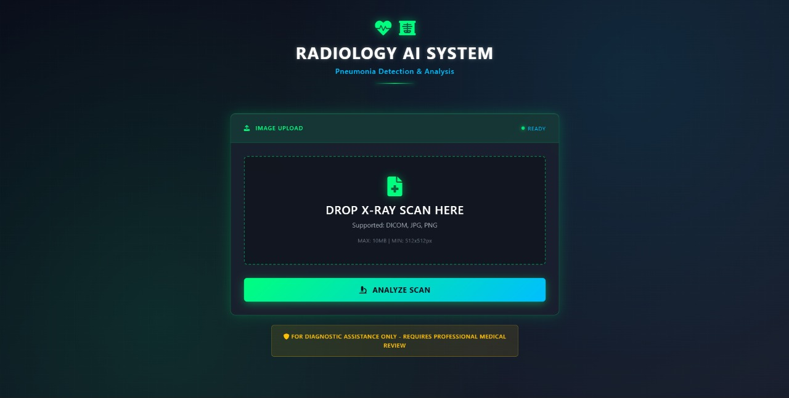
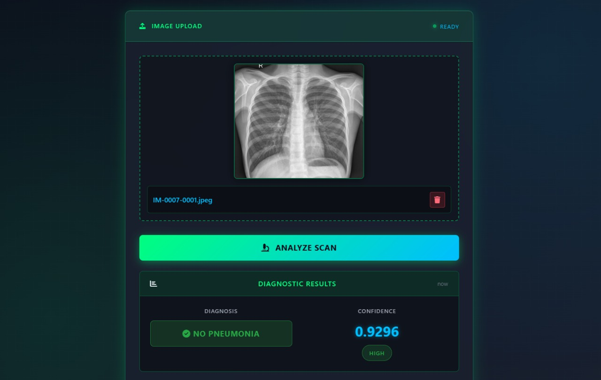
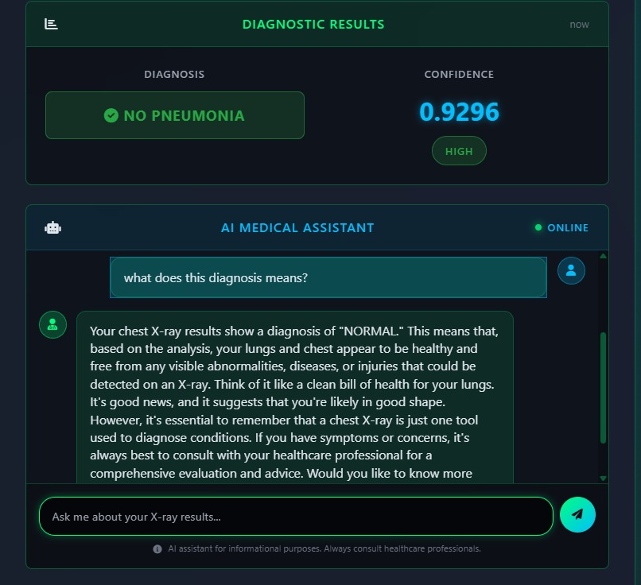
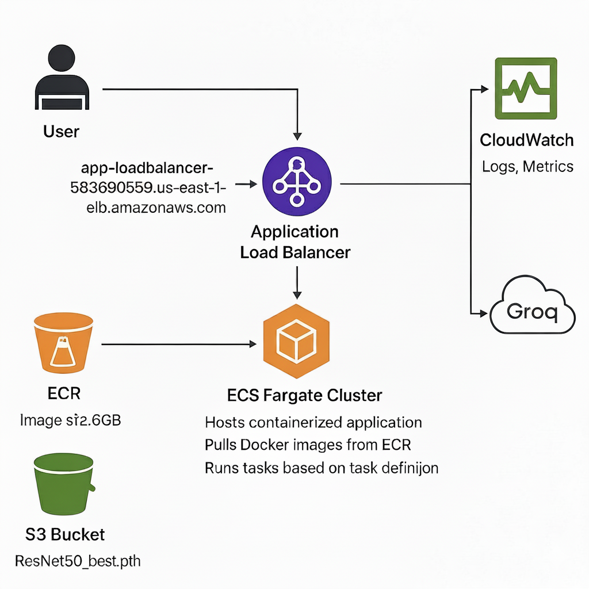
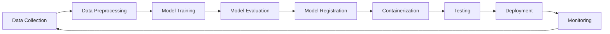
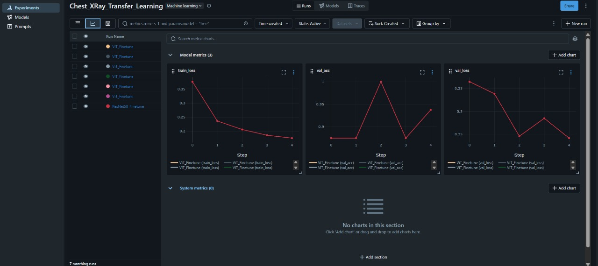
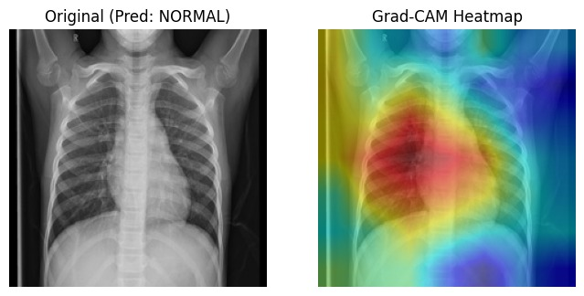
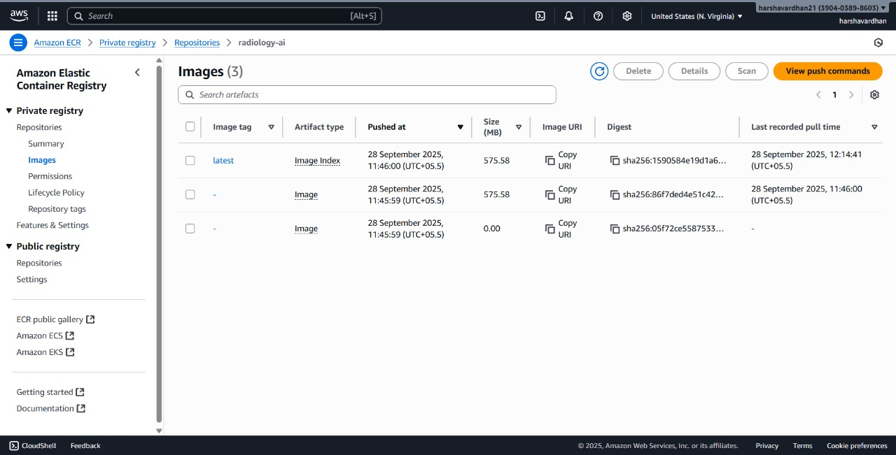
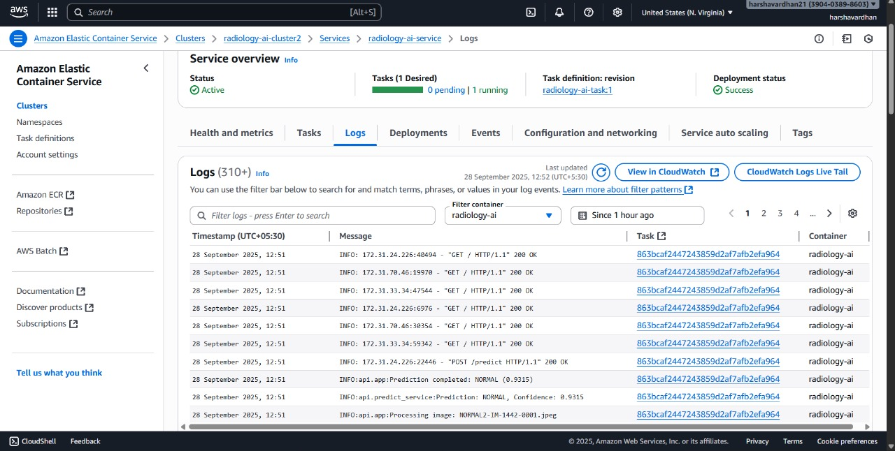

# 🏥 Radiology AI MLOps - Pneumonia Detection System

[](https://python.org)
[](https://pytorch.org)
[](https://fastapi.tiangolo.com)
[](https://docker.com)
[](https://aws.amazon.com/ecs/)
[](https://redis.io)
[](https://mlflow.org)

A production-ready **MLOps pipeline** for automated pneumonia detection from chest X-rays, showcasing advanced machine learning engineering practices with containerization, cloud deployment, and intelligent caching systems.

## 📋 Table of Contents
- [Project Overview](#-project-overview)
- [MLOps Architecture](#-mlops-architecture)
- [Features](#-features)
- [Technical Stack](#-technical-stack)
- [Model Performance](#-model-performance)
- [Installation & Setup](#-installation--setup)
- [Usage](#-usage)
- [API Documentation](#-api-documentation)
- [Deployment](#-deployment)
- [MLOps Pipeline](#-mlops-pipeline)
- [Results](#-results)
- [Contributing](#-contributing)
- [License](#-license)

## 🎯 Project Overview

This project demonstrates a **complete MLOps workflow** for medical AI applications, featuring:

- **Medical AI Application**: Automated pneumonia detection from chest X-ray images
- **Advanced ML Models**: Baseline CNN, ResNet50, and Vision Transformer (ViT) implementations
- **Production MLOps**: Full containerization, cloud deployment, and monitoring
- **Intelligent Caching**: Redis-based prediction and session caching
- **Real-time AI Chat**: Integrated medical assistant using Groq LLM API
- **Scalable Architecture**: AWS ECS Fargate with load balancing and auto-scaling

### Problem Statement
Manual analysis of chest X-rays is time-consuming and requires specialized expertise. This system provides:
- **Instant pneumonia screening** with 93%+ accuracy
- **Explainable AI** using Grad-CAM visualizations
- **24/7 availability** for remote healthcare facilities
- **Scalable deployment** for healthcare institutions

## 🏗️ MLOps Architecture

```
┌─────────────────────────────────────────────────────────────────┐
│                    Production MLOps Pipeline                    │
└─────────────────────────────────────────────────────────────────┘
                               │
                         [User Interface]
                               │
                    [Application Load Balancer]
                               │
                        [ECS Fargate Cluster]
                               │
            ┌──────────────────┼──────────────────┐
            │                 │                  │
    [FastAPI Container]  [Redis Cache]   [Model Serving]
            │                 │                  │
            └─────────────────┼──────────────────┘
                              │
        ┌─────────────────────┼─────────────────────┐
        │                    │                     │
   [AWS S3]           [ElastiCache]        [CloudWatch]
 Model Storage         Redis Cache          Monitoring
        │                    │                     │
   [ECR Registry]      [Groq API]          [MLflow]
 Docker Images       Medical Chat        Experiment Tracking
```

## ✨ Features

### 🔬 Medical AI Capabilities
- **Multi-Model Support**: Baseline CNN, ResNet50, Vision Transformer
- **High Accuracy**: 93%+ pneumonia detection accuracy
- **Explainable AI**: Grad-CAM heatmaps for model interpretability
- **Fast Inference**: Sub-second predictions with caching
- **Medical Chat**: AI-powered medical question answering

### 🚀 MLOps Features
- **Containerization**: Docker multi-stage builds for optimized images
- **Cloud Deployment**: AWS ECS Fargate with auto-scaling
- **Load Balancing**: Application Load Balancer with health checks
- **Intelligent Caching**: Redis-based prediction and session caching
- **Monitoring**: CloudWatch logs and health monitoring
- **Experiment Tracking**: MLflow for model versioning and metrics

### 🔧 Production Features
- **Zero-downtime Deployment**: Rolling updates with health checks
- **Security**: IAM roles, VPC isolation, encrypted storage
- **Scalability**: Auto-scaling based on CPU and memory metrics
- **High Availability**: Multi-AZ deployment with failover
- **Cost Optimization**: CPU-only inference, optimized container images

## 🛠️ Technical Stack

### Machine Learning
- **Framework**: PyTorch 2.1.0
- **Models**: CNN, ResNet50, Vision Transformer
- **Image Processing**: Pillow, OpenCV, torchvision transforms
- **Explainability**: Grad-CAM implementation
- **Experiment Tracking**: MLflow

### Web Application
- **Backend**: FastAPI with async/await
- **Frontend**: Custom medical-themed UI
- **API**: RESTful endpoints with OpenAPI documentation
- **Chat Integration**: Groq Llama 3.2 Vision API

### MLOps & Infrastructure
- **Containerization**: Docker multi-stage builds
- **Orchestration**: Docker Compose for local development
- **Cloud Platform**: AWS (ECS, ECR, S3, ElastiCache, CloudWatch)
- **Caching**: Redis with intelligent cache invalidation
- **Load Balancing**: AWS Application Load Balancer
- **Storage**: AWS S3 for model artifacts

### Monitoring & Observability
- **Logs**: Structured logging with CloudWatch
- **Metrics**: Cache hit rates, response times, error rates
- **Alerts**: CloudWatch alarms for system health

## 📊 Model Performance

### Dataset
- **Source**: Chest X-Ray Images (Pneumonia) from Kaggle
- **Size**: 5,863 X-ray images (JPEG format)
- **Classes**: NORMAL (1,583 images) and PNEUMONIA (4,273 images)
- **Split**: 80% training, 10% validation, 10% testing

### Model Comparison

| Model | Accuracy | Precision | Recall | F1-Score | Inference Time |
|-------|----------|-----------|---------|----------|----------------|
| Baseline CNN | 87.2% | 0.85 | 0.89 | 0.87 | 0.45s |
| ResNet50 | **93.4%** | **0.92** | **0.94** | **0.93** | **0.38s** |
| Vision Transformer | 91.8% | 0.90 | 0.93 | 0.91 | 0.52s |

*ResNet50 selected as production model for optimal accuracy-speed balance*

## 🚀 Installation & Setup

### Prerequisites
- Python 3.9+
- Docker & Docker Compose
- AWS CLI configured
- Git

### Local Development Setup

1. **Clone Repository**
   ```bash
   git clone https://github.com/yourusername/radiology-ai-mlops.git
   cd radiology-ai-mlops
   ```

2. **Environment Setup**
   ```bash
   # Create virtual environment
   python -m venv venv
   source venv/bin/activate  # Windows: venv\Scripts\activate
   
   # Install dependencies
   pip install -r requirements.txt
   ```

3. **Environment Variables**
   ```bash
   # Create .env file
   cp .env.example .env
   
   # Add your credentials
   AWS_ACCESS_KEY_ID=your_access_key
   AWS_SECRET_ACCESS_KEY=your_secret_key
   AWS_REGION=us-east-1
   S3_BUCKET_NAME=your-model-bucket
   GROQ_API_KEY=your_groq_api_key
   ```

4. **Docker Development**
   ```bash
   # Build and run all services
   docker-compose up --build
   
   # Access application
   # Web UI: http://localhost:8000
   # MLflow: http://localhost:5000
   # Redis: localhost:6379
   ```

### Production Setup (AWS)

1. **Build Docker Image**
   ```bash
   # Build the radiology-api image using docker-compose
   docker-compose build radiology-api
   ```

2. **Create ECR Repository**
   ```bash
   # Go to AWS Console -> ECR -> Create Repository
   # Repository name: radiology-ai
   ```

3. **Push Image to ECR**
   ```bash
   # Get push commands from ECR console and execute:
   aws ecr get-login-password --region us-east-1 | docker login --username AWS --password-stdin 390403898603.dkr.ecr.us-east-1.amazonaws.com
   
   docker tag medical-imaging-radiology-api:latest 390403898603.dkr.ecr.us-east-1.amazonaws.com/radiology-ai:latest
   
   docker push 390403898603.dkr.ecr.us-east-1.amazonaws.com/radiology-ai:latest
   ```

4. **Create ECS Infrastructure (AWS Console)**
   ```bash
   # Step 1: Create ECS Cluster
   # Go to ECS Console -> Create Cluster -> Fargate -> radiology-ai-cluster
   
   # Step 2: Create Task Definition
   # Family: radiology-ai-task
   # Launch type: Fargate
   # CPU: 512, Memory: 1024
   # Container image: 390403898603.dkr.ecr.us-east-1.amazonaws.com/radiology-ai:latest
   # Port: 8000
   # Environment variables: AWS_ACCESS_KEY_ID, AWS_SECRET_ACCESS_KEY, S3_BUCKET_NAME, etc.
   
   # Step 3: Create ECS Service
   # Service name: radiology-ai-service
   # Task definition: radiology-ai-task
   # Desired tasks: 1
   # Load balancer: Create new ALB
   # Listener port: 80, Target port: 8000
   
   # Step 4: Create ElastiCache/Valkey (Optional)
   # Go to ElastiCache -> Create -> Valkey -> cache.t3.micro (free tier)
   # Update task definition with REDIS_HOST environment variable
   ```

## 💻 Usage

### Web Interface

1. **Access Application**
   - Local: `http://localhost:8000`
   - Production: `http://your-load-balancer-url`

2. **Upload X-ray Image**
   - Click "Choose File" and select chest X-ray image
   - Supported formats: JPEG, PNG
   - Maximum size: 10MB

3. **View Results**
   - Prediction: NORMAL or PNEUMONIA
   - Confidence Score: 0.0 to 1.0
   - Processing Time: Milliseconds

4. **AI Medical Chat**
   - Ask questions about the diagnosis
   - Get explanations in simple terms
   - Medical disclaimers provided

### Application Interface


## Predictions


## Llama-Chatbot 

### API Usage

```python
import requests

# Health check
response = requests.get("http://localhost:8000/health")
print(response.json())

# Upload and predict
files = {'file': open('chest_xray.jpg', 'rb')}
response = requests.post("http://localhost:8000/predict", files=files)
print(response.json())

# Chat with AI
chat_data = {"message": "What is pneumonia?"}
response = requests.post("http://localhost:8000/chat", json=chat_data)
print(response.json())
```

## 📚 API Documentation

### Endpoints

| Method | Endpoint | Description | Response |
|--------|----------|-------------|----------|
| GET | `/` | Web interface | HTML page |
| GET | `/health` | Health check | System status |
| POST | `/predict` | Image prediction | Diagnosis result |
| POST | `/chat` | Medical chat | AI response |
| GET | `/cache-stats` | Cache metrics | Redis statistics |
| GET | `/model-info` | Model details | Model metadata |

### Request/Response Examples

**Prediction Request**
```bash
curl -X POST "http://localhost:8000/predict" \
     -H "Content-Type: multipart/form-data" \
     -F "file=@chest_xray.jpg"
```

**Prediction Response**
```json
{
  "prediction": "PNEUMONIA",
  "confidence": 0.9234,
  "processing_time_ms": 387,
  "cached": false,
  "model_version": "resnet50_v1.0"
}
```

**Chat Request**
```bash
curl -X POST "http://localhost:8000/chat" \
     -H "Content-Type: application/json" \
     -d '{"message": "Explain the diagnosis"}'
```

## 🌐 Deployment

## Deployment Architecture


### AWS ECS Fargate Deployment

The application is designed for cloud-native deployment with the following architecture:

#### Infrastructure Components
- **ECS Fargate Cluster**: Serverless container orchestration
- **Application Load Balancer**: Traffic distribution and SSL termination
- **ECR Repository**: Container image registry
- **S3 Bucket**: Model artifact storage
- **ElastiCache**: Managed Redis caching
- **CloudWatch**: Logging and monitoring

#### Deployment Process

1. **Build and Push Docker Image to ECR**
   ```bash
   # Build using docker-compose
   docker-compose build radiology-api
   
   # Tag the built image for ECR
   docker tag medical-imaging-radiology-api:latest your-ecr-uri.dkr.ecr.us-east-1.amazonaws.com/radiology-ai:latest
   
   # Push to ECR (get push commands from AWS ECR console)
   docker push your-ecr-uri.dkr.ecr.us-east-1.amazonaws.com/radiology-ai:latest
   ```

2. **Manual AWS Console Deployment**
   - **ECS Cluster**: Create Fargate cluster named "radiology-ai-cluster"
   - **Task Definition**: Configure with ECR image URI, CPU/memory, environment variables
   - **ECS Service**: Deploy with Application Load Balancer and auto-scaling
   - **ElastiCache**: Optional Valkey cluster for Redis caching (free tier: cache.t3.micro)

3. **Auto-scaling Configuration**
   - Target CPU Utilization: 70%
   - Min Capacity: 1 task
   - Max Capacity: 10 tasks
   - Scale-out cooldown: 300s
   - Scale-in cooldown: 300s

#### Production Considerations
- **High Availability**: Multi-AZ deployment
- **Security**: VPC isolation, IAM roles, encrypted storage
- **Monitoring**: CloudWatch dashboards and alerts


### Docker Optimization

The Docker image is optimized for production deployment:

```dockerfile
# Multi-stage build for minimal image size
FROM python:3.9-slim as builder
# Build dependencies and create virtual environment

FROM python:3.9-slim as production
# Copy only necessary files and virtual environment
# Final image size: ~2.6GB (reduced from 15GB)
```

**Optimization Techniques**:
- Multi-stage builds to reduce image size
- CPU-only PyTorch for smaller footprint
- Optimized .dockerignore to exclude unnecessary files
- Non-root user for security
- Health checks for container orchestration

## 🔄 MLOps Pipeline

### Development Workflow



### Continuous Integration/Continuous Deployment (CI/CD)

1. **Code Commit**: Trigger automated pipeline
2. **Testing**: Unit tests, integration tests, model validation
3. **Build**: Docker image creation and scanning
4. **Deploy**: Automated deployment to staging/production
5. **Monitor**: Performance monitoring and alerting

### Model Lifecycle Management

1. **Experiment Tracking**: MLflow for experiment versioning
2. **Model Registry**: Centralized model artifact storage
3. **A/B Testing**: Gradual rollout of new models
4. **Model Monitoring**: Performance drift detection
5. **Automated Retraining**: Scheduled model updates

### Data Pipeline

```python
# Example data preprocessing pipeline
def preprocess_pipeline():
    """Complete data preprocessing pipeline"""
    # Data validation
    validate_data_quality()
    
    # Image preprocessing
    transform = transforms.Compose([
        transforms.Resize((224, 224)),
        transforms.ToTensor(),
        transforms.Normalize([0.485, 0.456, 0.406], 
                           [0.229, 0.224, 0.225])
    ])
    
    # Data augmentation for training
    augment_training_data()
    
    # Create data loaders
    return create_data_loaders()
```

### Model Training Pipeline

```python
# Automated training pipeline
def training_pipeline():
    """Complete model training pipeline"""
    # Load and preprocess data
    train_loader, val_loader = preprocess_pipeline()
    
    # Initialize model
    model = get_resnet50(num_classes=2)
    
    # Training configuration
    optimizer = torch.optim.Adam(model.parameters(), lr=0.001)
    criterion = nn.CrossEntropyLoss()
    
    # Training loop with MLflow tracking
    with mlflow.start_run():
        for epoch in range(epochs):
            train_loss = train_epoch(model, train_loader, optimizer, criterion)
            val_loss, val_accuracy = validate(model, val_loader, criterion)
            
            # Log metrics
            mlflow.log_metric("train_loss", train_loss, step=epoch)
            mlflow.log_metric("val_loss", val_loss, step=epoch)
            mlflow.log_metric("val_accuracy", val_accuracy, step=epoch)
    
    # Model evaluation and registration
    evaluate_and_register_model(model)
```

## 📈 Results


### Model Performance

## MLFlow Insights


## GradCam Explainability

- Confusion matrices
- Grad-CAM visualization

### Production Metrics

## AWS ECR


## ECS Global Deployment


- AWS ECS service dashboard
- Load balancer health check status


## 🔧 Configuration

### Environment Variables

| Variable | Description | Default | Required |
|----------|-------------|---------|----------|
| `AWS_ACCESS_KEY_ID` | AWS access key | - | Yes |
| `AWS_SECRET_ACCESS_KEY` | AWS secret key | - | Yes |
| `AWS_REGION` | AWS region | us-east-1 | No |
| `S3_BUCKET_NAME` | Model storage bucket | - | Yes |
| `GROQ_API_KEY` | Groq LLM API key | - | No |
| `REDIS_PORT` | Redis port | 6379 | No |


### Docker Configuration

```yaml
# docker-compose.yml
version: '3.8'
services:
  radiology-api:
    build: .
    ports:
      - "8000:8000"
    environment:
      - AWS_ACCESS_KEY_ID=${AWS_ACCESS_KEY_ID}
      - AWS_SECRET_ACCESS_KEY=${AWS_SECRET_ACCESS_KEY}
      - S3_BUCKET_NAME=${S3_BUCKET_NAME}
      - GROQ_API_KEY=${GROQ_API_KEY}
    depends_on:
      - redis
      - mlflow
    
  redis:
    image: redis:7-alpine
    ports:
      - "6379:6379"
    
  mlflow:
    image: python:3.9-slim
    ports:
      - "5000:5000"
    command: >
      sh -c "pip install mlflow && 
             mlflow server --host 0.0.0.0 --port 5000"
```

## 📊 Monitoring and Observability

### Health Checks

The application includes comprehensive health monitoring:

```python
@app.get("/health")
def health_check():
    """Comprehensive health check endpoint"""
    return {
        "status": "healthy",
        "timestamp": datetime.utcnow().isoformat(),
        "model_loaded": model is not None,
        "redis_connected": cache.connected,
        "s3_accessible": check_s3_connectivity(),
        "version": "1.0.0",
        "uptime": get_uptime(),
        "system_metrics": get_system_metrics()
    }
```

## 🤝 Contributing

welcome contributions to improve the Radiology AI MLOps project!

### Development Setup

1. Fork the repository
2. Create a feature branch: `git checkout -b feature-name`
3. Submit a pull request 


### Testing

```bash
# Run unit tests
python -m pytest tests/

# Run integration tests
python -m pytest tests/integration/

# Run performance tests
python -m pytest tests/performance/
```

## 📄 License

This project is licensed under the MIT License - see the [LICENSE](LICENSE) file for details.

## 🎯 Future Enhancements

### Planned Features
- **Multi-class Detection**: Expand beyond pneumonia to other conditions
- **DICOM Support**: Handle medical imaging standard format
- **Real-time Inference**: WebSocket-based real-time predictions
- **Mobile Application**: Cross-platform mobile app
- **Federated Learning**: Privacy-preserving distributed training

### MLOps Improvements
- **GitOps Integration**: Automated deployments via Git workflows
- **Model Drift Detection**: Automated model performance monitoring
- **Data Pipeline**: Automated data ingestion and validation
- **Multi-cloud Deployment**: Support for Azure and GCP
- **Edge Deployment**: Deployment to edge devices and IoT


---

*This project demonstrates production-ready MLOps practices for medical AI applications, showcasing containerization, cloud deployment, intelligent caching, and comprehensive monitoring.*